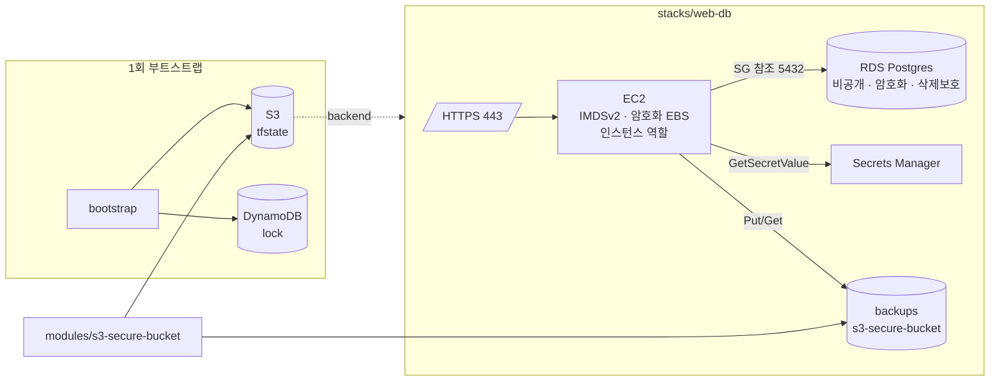

# AWS Secure IaC Baseline

[](https://github.com/on-xohye30/terraform-setting/actions/workflows/ci.yml)


Terraform으로 AWS 인프라를 올릴 때 **보안 설정을 사람이 기억해서 넣는 것이 아니라, 모듈 기본값과 파이프라인이 강제하도록** 만든 베이스라인입니다.
취약점 분석 업무에서 반복적으로 보이는 클라우드 설정 오류(공개 버킷, 전체 개방 보안그룹, 미암호화 스토리지, 하드코딩 시크릿, IMDSv1)를
코드 레벨에서 발생하지 않게 막는 것이 목표입니다.

## 구성

| 경로 | 역할 | 핵심 보안 결정 |
|---|---|---|
| [`modules/s3-secure-bucket`](modules/s3-secure-bucket) | 호출자가 옵션을 주지 않아도 안전한 S3 버킷 모듈 | 퍼블릭 4중 차단, 소유권 강제, 저장 암호화, 버전 관리, TLS 전용 정책, 수명주기 |
| [`bootstrap`](bootstrap) | 원격 state 저장소(S3) + 잠금 테이블(DynamoDB) 1회 생성 | state 를 시크릿으로 취급: 암호화·버전 관리·퍼블릭 차단·삭제 보호 |
| [`stacks/web-db`](stacks/web-db) | 웹 인스턴스 + RDS + 백업 버킷으로 구성된 참조 스택 | 최소권한 IAM, SG 참조 기반 접근 제어, Secrets Manager, IMDSv2, 비공개 DB |
| [`policy`](policy) | plan 결과(JSON)에 대한 OPA/Conftest 정책 | 스캐너가 놓치는 조직 규칙을 코드로 강제 |
| [`.github/workflows/ci.yml`](.github/workflows/ci.yml) | fmt → validate → tfsec → checkov → conftest | 배포 전 차단, 예외는 사유와 함께 코드에 기록 |
| [`docs`](docs) | 아키텍처와 보안 결정 기록(ADR) | 왜 이렇게 했는지 추적 가능하게 |

## 아키텍처



## 보안 설계 원칙

1. **안전한 기본값(secure by default).** 모듈은 옵션을 생략해도 가장 안전한 상태로 생성된다. 위험한 설정은 명시적으로 켜야 하며, 그마저도 `validation` 으로 막는 것이 있다(예: `0.0.0.0/0` 관리 CIDR).
2. **시크릿은 코드·state·plan 어디에도 평문으로 두지 않는다.** DB 비밀번호는 `random_password` → Secrets Manager 로 생성·보관하고, 인스턴스는 역할로 런타임에 조회한다. 프로바이더 인증은 환경변수/OIDC 로만 받는다.
3. **네트워크 접근은 CIDR 이 아니라 관계로 정의한다.** DB 보안그룹은 웹 보안그룹을 참조한다. IP 목록 관리가 아니라 "누가 누구에게" 를 코드로 표현한다.
4. **state 는 시크릿이다.** 원격 백엔드는 암호화·버전 관리·퍼블릭 차단·잠금이 기본이며 `prevent_destroy` 로 보호한다.
5. **검증은 사람이 아니라 파이프라인이 한다.** 정적 분석 2종(tfsec, checkov) + plan 기반 정책(Conftest) 을 PR 에서 강제한다. 예외는 사유 주석 없이는 허용하지 않는다.

세부 근거는 [docs/security-decisions.md](docs/security-decisions.md) 에 ADR 형식으로 기록했습니다.

## 사용법

### 0. 요구사항

- Terraform >= 1.6, AWS 자격증명(환경변수 또는 프로파일). CI 는 OIDC 를 권장한다.
- 선택: `tfsec`, `checkov`, `conftest` (로컬에서 CI 와 동일한 검사를 돌릴 때)

### 1. 원격 state 부트스트랩 (계정당 1회)

```bash
cd bootstrap
terraform init
terraform apply -var state_bucket_name=<org>-tfstate-<env>-<account-suffix>
terraform output -raw backend_config > ../stacks/web-db/backend.hcl
```

### 2. 스택 배포

```bash
cd stacks/web-db
cp example.tfvars <env>.tfvars      # 값 채우기 (vpc_id, private_subnet_ids, admin_cidrs 등)
terraform init -backend-config=backend.hcl
terraform plan -var-file=<env>.tfvars -out=tfplan
terraform show -json tfplan > tfplan.json
conftest test tfplan.json -p ../../policy   # 조직 정책 통과 확인
terraform apply tfplan
```

### 3. 모듈만 재사용

```hcl
module "logs" {
  source      = "github.com/on-xohye30/terraform-setting//modules/s3-secure-bucket?ref=v0.1.0"
  bucket_name = "myorg-prod-logs-1234"
  kms_key_arn = aws_kms_key.logs.arn   # 생략 시 SSE-S3
}
```

## 검증 파이프라인

| 단계 | 도구 | 실패 조건 |
|---|---|---|
| 포맷 | `terraform fmt -check -recursive` | 포맷 불일치 |
| 문법·타입 | `terraform validate` (모듈·bootstrap·스택 각각) | 참조 오류, 타입 불일치, validation 위반 |
| 정적 분석 | tfsec | HIGH 이상 |
| 정적 분석 | checkov | 스킵 목록(`.checkov.yaml`) 외 모든 실패 |
| 정책 | conftest + `policy/*.rego` | `deny` 규칙 위반 (정책 자체는 `conftest verify` 로 단위 테스트) |

### 스캐너 예외 정책

예외는 **해당 줄에 사유를 남기는 것** 만 허용한다. 전역 스킵은 `.checkov.yaml` 에 사유와 함께 기록한다.

```hcl
#tfsec:ignore:aws-s3-enable-bucket-logging 로그 버킷 자신은 순환 로깅 대상에서 제외
```

## 디렉터리

```
.
├── modules/s3-secure-bucket/     # 재사용 모듈 (versions / variables / main / outputs / README)
├── bootstrap/                    # 원격 state + 잠금 (로컬 state 로 1회 실행)
├── stacks/web-db/                # 참조 스택 (backend.hcl 은 커밋하지 않음)
├── policy/                       # Conftest 정책 + 테스트
├── docs/                         # architecture.md, security-decisions.md
├── .github/workflows/ci.yml
├── .checkov.yaml
└── .pre-commit-config.yaml
```

## 로드맵

- [ ] KMS 키 모듈 추가 후 S3·RDS·Secrets Manager 기본 암호화를 CMK 로 상향
- [ ] VPC 모듈(프라이빗 서브넷, 플로우 로그, 엔드포인트) 추가로 스택 입력 축소
- [ ] GitHub Actions OIDC 역할 + `plan` 결과 PR 코멘트
- [ ] Terraform 1.10 `ephemeral` 리소스로 DB 비밀번호가 state 에 남지 않도록 전환
