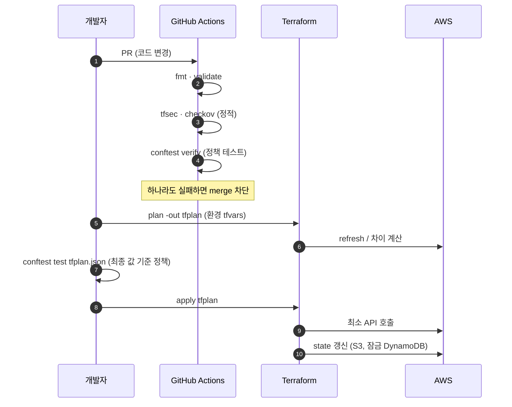
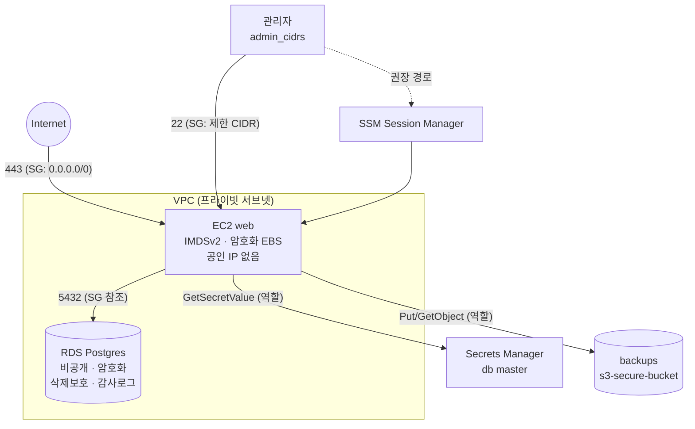

# Architecture

## 계층

```
┌──────────────────────────────────────────────────────────────┐
│  stacks/            환경별로 배포되는 단위. backend 로 state 분리 │
│    web-db/          모듈을 조합 + 스택 고유 리소스              │
├──────────────────────────────────────────────────────────────┤
│  modules/           재사용 단위. provider 없음, 보안 기본값 내장  │
│    s3-secure-bucket/                                          │
├──────────────────────────────────────────────────────────────┤
│  bootstrap/         스택들이 의존하는 원격 state 인프라 (1회)     │
├──────────────────────────────────────────────────────────────┤
│  policy/ + CI       모든 계층에 공통 적용되는 검증               │
└──────────────────────────────────────────────────────────────┘
```

- **모듈**은 "무엇이 안전한가" 를 안다. 호출자는 이름과 몇 개 옵션만 준다.
- **스택**은 "무엇을 조합하는가" 를 안다. 환경 차이는 `*.tfvars` 로만 표현하고 코드는 같다.
- **bootstrap**은 다른 모든 것이 의존하므로 가장 먼저, 가장 보수적으로 만든다.

## 배포 흐름



## 스택 web-db 의 데이터 흐름과 신뢰 경계



신뢰 경계를 넘는 모든 화살표는 **보안그룹 규칙 + IAM 정책 + 암호화** 세 겹으로 통제된다.

- 인터넷 → EC2: 443 만. SSH 는 관리 CIDR 로 제한되며 SSM 을 기본 경로로 둔다.
- EC2 → RDS: CIDR 이 아니라 웹 보안그룹 **참조**. 웹 인스턴스가 늘어나도 규칙이 바뀌지 않는다.
- EC2 → 시크릿/버킷: 인스턴스 역할이 **해당 ARN 에만** 권한을 가진다. 시크릿 값은 user_data 나 state 출력에 나타나지 않는다.

## state 경계

| 대상 | state 위치 | 잠금 |
|---|---|---|
| bootstrap | 로컬 → 생성 후 자기 버킷으로 이전 권장 | 없음(1회성) |
| stacks/web-db | `s3://<tfstate-bucket>/stacks/web-db/terraform.tfstate` | DynamoDB `terraform-locks` |

스택마다 `key` 가 다르므로 한 스택의 사고가 다른 스택의 state 를 손상시키지 않는다.
